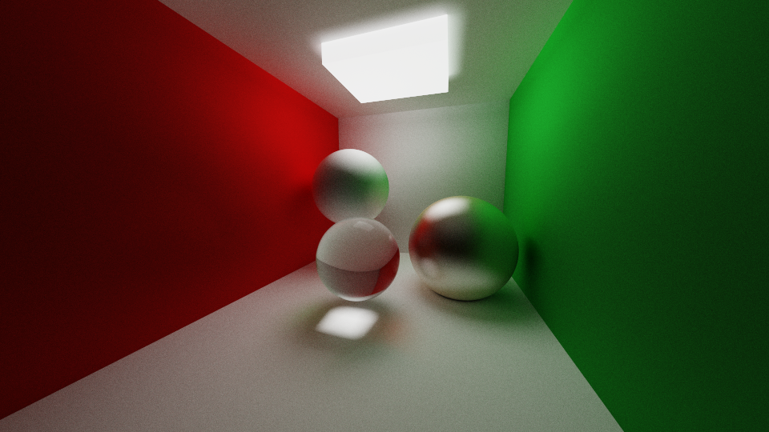
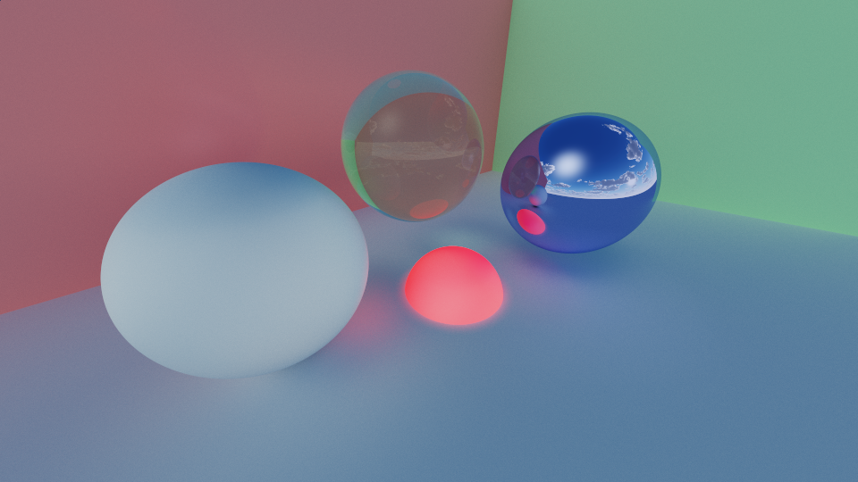
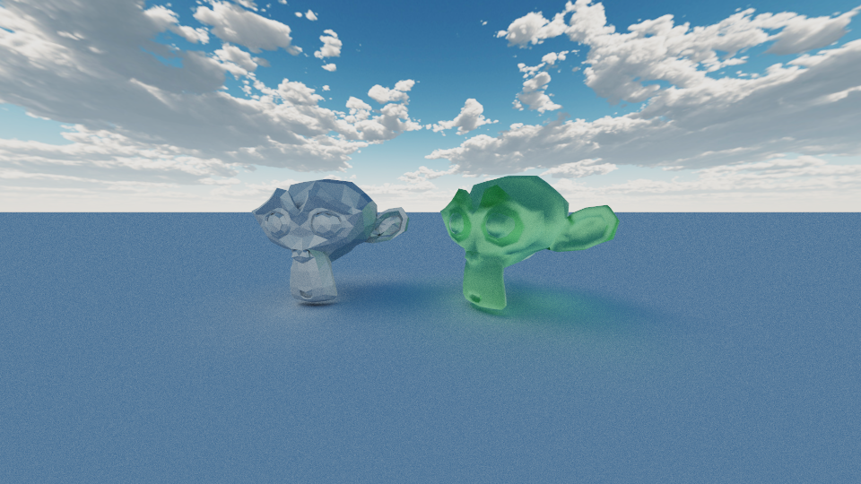

# Simple raytracer

A simple ray tracing "engine" written in C++ and OpenCL using boost.compute. 

## Showcase







## Building

This project needs `boost` and `OpenCL` to be installed on the system.

```
$ git clone https://github.com/davawen/Simple-Raytracer
$ meson setup build
$ meson compile -C build
```

To run the project, just launch the executable:
```
$ ./build/tracer
```

Note the you must be in the project's directory to run it, as it reads `src/render.cl`.

## Features

- [x] Basic shape intersections (plane, sphere, box)
- [x] Metallic, specular and refractive materials
- [-] Model loading (.stl and .obj files)
    - Wavefront (.obj) meshes need to be triangulated, and don't support materials
- [x] Light accumulation (eliminate noise over time)
- [x] UI and gizmos to place objects

## Future plans

- [ ] Acceleration structure (BVH)
- [ ] Texture support
- [ ] Scene saving and loading
- [ ] Denoising

## Credits

- [`stb_image.h`](https://github.com/nothings/stb/blob/master/stb_image.h) by @nothings
- [tinygizmo](https://github.com/ddiakopoulos/tinygizmo) by @ddiakopoulos
- [Dear ImGui](https://github.com/ocornut/imgui)
